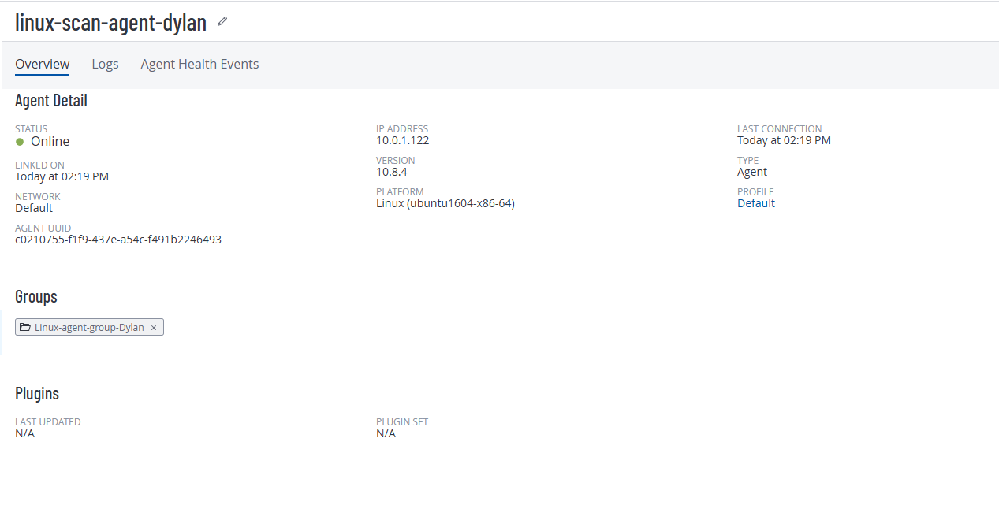

# Vulnerability Scanning Lab (Azure + Tenable)

Hands‐on demo of running unauthenticated vs. authenticated scans against a Linux VM.  
Includes step‐by‐step setup: VM provisioning, agent group creation, scan configuration, triggering, and reviewing results.

---

## 🛠️ Steps & Screenshots

### 1. VM Provisioning  
  
*Azure Portal showing `linux-scan-agent-dylan` VM details (Size, OS, IP).*

### 2. Create Agent Group  
  
*“Linux-agent-group-Dylan” created under **Sensors → Agent Groups**.*

### 3. Install & Link Agent  
  
*`curl -H 'X-Key: …' 'https://sensor.cloud.tenable/install/agent?...' | bash`*  
  
*Terminal output showing “INSTALL PASSED” and auto-configuration complete.*

### 4. Verify Agent Online  
  
*Agent status “Online” with IP, Platform, and “Linked on” timestamp.*

### 5. Configure & Trigger Scan  
  
*“Basic Agent Scan” configured to use `Linux-agent-group-Dylan` with a Triggered Scan on filename `dishsoap.lol`.*  
  
*On VM: `touch /opt/nessus_agent/var/nessus/triggers/dishsoap.lol`.*

### 6. View Scan Results  
  
*Final report showing critical, high, medium and low vulnerabilities under “Vulns by Plugin.”*

---

## 🔗 Links

- 👉 [Live demo video (YouTube)](https://youtu.be/Vn_L0xCZq7M?si=85hbWY88JREd2cCz)  
- 👉 [Project source on GitHub](https://github.com/Dyl257/Dyl257/tree/Vulnerability)

---

## 🧰 Tech Stack

- **Platform:** Azure Linux VM (Ubuntu 16.04)  
- **Scanner:** Tenable.io Agents & Nessus  
- **Scripting:** Bash (curl installer + trigger)  
